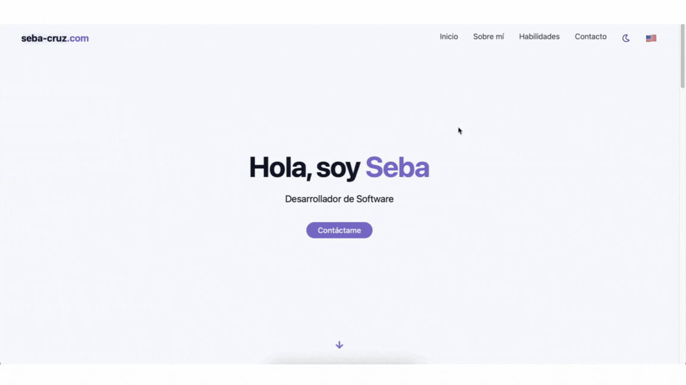

# Portafolio

Este es el repositorio de mi página web personal, desarrollada con **Vite + React** y estilizada con **Tailwind CSS**.
El objetivo de este proyecto es mostrar mi portafolio, experiencia y proyectos, así como ofrecer un medio de contacto profesional.

---

## Tecnologías utilizadas

- [Vite](https://vitejs.dev/) — Bundler rápido para desarrollo y build.
- [React](https://react.dev/) — Librería para construir interfaces de usuario.
- [Tailwind CSS](https://tailwindcss.com/) — Framework de estilos utility-first.
- [Lucide React](https://lucide.dev/) — Iconos personalizables en React.
- **ThemeToggle** (modo oscuro/claro) integrado en el Navbar.
- **Selección de idioma** Alternar entre Español/English

---

## CI con GitHub Actions

El repositorio incluye flujo de integración continua (`.github/workflows/tests.yml`) que ejecuta los tests E2E:

1. **Instalación y build**
   - `npm ci`
   - `npm run build`
2. **Instalación navegadores Playwright**
   - `npx playwright install --with-deps`
3. **Ejecución de tests**
   - `npx playwright test`
4. **Artifacts**
   - Reporte HTML (`playwright-report/` o `test-results/html` según config).
   - Traces en caso de fallo (`test-results/**/trace.zip`).

Esto asegura que la build de producción (`preview`) funciona correctamente en **desktop y mobile**, incluyendo Safari.
En el caso que los tests se aprueben se ejecuta `deploy.yml` que despliega el proyecto a la página web hosteada en Vercel.

---

## Vista previa

