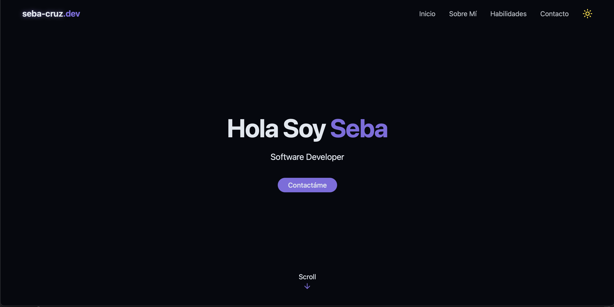

# Portafolio

Este es el repositorio de mi página web personal, desarrollada con **Vite + React** y estilizada con **Tailwind CSS**.  
El objetivo de este proyecto es mostrar mi portafolio, experiencia y proyectos, así como ofrecer un medio de contacto profesional.

---

## 🚀 Tecnologías utilizadas

- ⚡ [Vite](https://vitejs.dev/) — Bundler rápido para desarrollo y build.
- ⚛️ [React](https://react.dev/) — Librería para construir interfaces de usuario.
- 🎨 [Tailwind CSS](https://tailwindcss.com/) — Framework de estilos utility-first.
- 📦 [Lucide React](https://lucide.dev/) — Iconos personalizables en React.

---

## 📸 Vista previa

